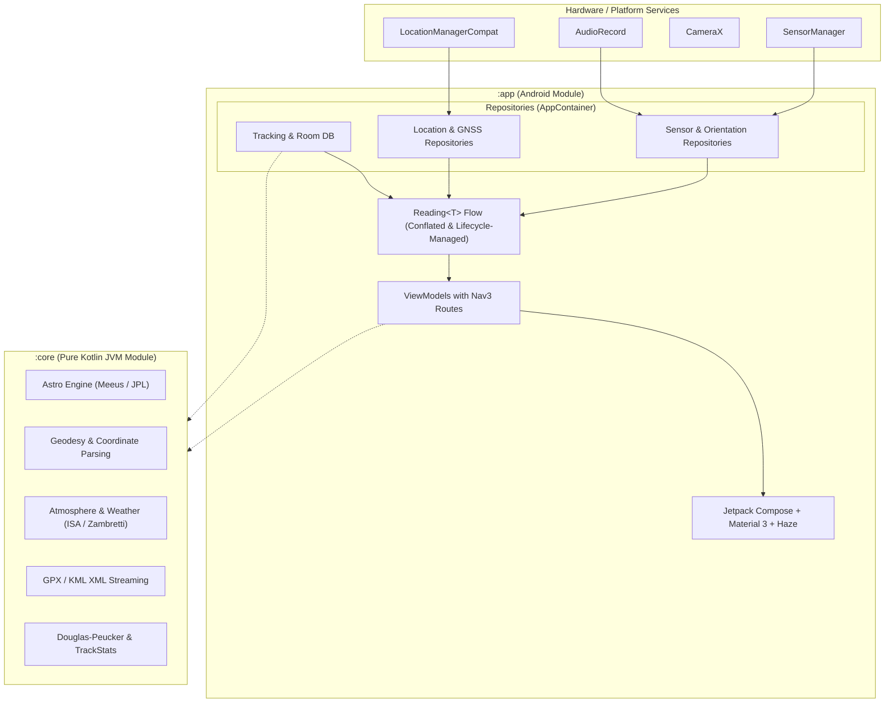

# TrailBlazer

[-3DDC84?logo=android&logoColor=white)](https://developer.android.com)
[](https://kotlinlang.org)
[](https://developer.android.com/jetpack/compose)
[](#privacy)
[](docs/ARCHITECTURE.md)

A native Android companion for backcountry trekking, mountaineering expeditions, and road journeys. TrailBlazer combines precision navigational instruments, astronomical ephemerides, mountain weather analytics, an offline trip planner, a GPS track recorder, and sensor diagnostics into a clean, distraction-free interface.

Built entirely with **Jetpack Compose** and **Material 3**, featuring frosted-glass chrome powered by [Haze](https://github.com/chrisbanes/haze).

> **No Fake Data.** Every value displayed is either a real physical reading, *Acquiring*, or *Unavailable* with an explicit reason (no hardware, permission denied, or sensor turned off). Values kept while the screen is paused are explicitly marked stale. There are zero simulated values, fake defaults, or background telemetry trackers.

---

## Features

The interface is structured into four primary tabs. Every capability lives in exactly one predictable home:

| Tab | Key Capabilities |
|---|---|
| **Now** | **Precision Compass Dial**: True or magnetic heading with World Magnetic Model (WMM) declination display.<br>• **Spirit Bubble & Reticle**: Integrated level reticle with tactile haptic snapping when flat.<br>• **Camera Visor Zeroing**: Calibrate table or Pixel camera visor resting tilt offsets (persisted in settings).<br>• **Confidence Wedge**: Dynamic beam visualizing heading certainty based on geomagnetic dip and device tilt.<br>• **Position & Elevation**: Coordinates (DMS or decimal), fix accuracy, satellite counts, and dual-labelled MSL/WGS-84 GPS vs. barometric altitude.<br>• **Sight Overlay**: CameraX viewfinder with real-time target, Sun, and Moon bearing lines.<br>• **Speed Alert**: Current velocity with configurable hysteresis-backed over-speed alerts.<br>• **Mark Waypoint & Quick Level**: Instant point-of-interest marking and one-tap leveling access. |
| **Sky** | **Scrubbable Solar Day**: Interactive Sun elevation curve through the day, projected on an azimuthal horizon compass.<br>• **Solar Events**: Sunrise, solar noon, sunset bearings, first/last light, civil/nautical/astronomical twilight, golden & blue hours, and live shadow ratios.<br>• **Moon Tracker**: Illumination percentage, rising/peak/setting bearings, real-time terminator disc rendering tailored to hemisphere.<br>• **Moon Phase Calendar**: Interactive lunar cycle dropdown with dates of the next four principal phases (verified against USNO).<br>• **Mountain Weather**: Least-squares 3-hour pressure trend, UK Met Office tendency labels, Zambretti rule-of-thumb local forecaster, and storm drop alerts.<br>• **Online Forecast (Opt-in)**: Privacy-preserving Open-Meteo weather with hourly forecasts and multi-day Outlook.<br>• **Tonight's Sky**: Seamless hand-off to offline stargazing for the current or chosen location. |
| **Trips** | **Multi-Stop Trip Planning**: Origin, destination, intermediate waypoints, and overnight night stops.<br>• **Offline Route Sketching**: Straight-line leg distances, initial bearings, and daylight availability calculated per stop.<br>• **Map App Hand-Off**: Direct intent handoff to Google Maps (with multi-waypoint chaining beyond Google's 9-stop limit) or OpenStreetMap.<br>• **Find a Place**: Search by name/address (opt-in), paste coordinates or map URLs, clipboard detection, or pick from nearest saved waypoints.<br>• **Shared Map Links**: Receive shared locations from Google Maps or OSM; resolves short links offline where possible or via consent-gated header inspection.<br>• **Track Recording & Management**: Foreground GPS tracking service with crash recovery, streaming stats (moving time, elevation gain/loss with 3 m noise hysteresis), GPX/KML import and export. |
| **Tools** | **Tactile Level & Inclinometer**: Spirit level and roll/pitch gauges with vehicle zeroing. Haptic detents at every degree within 4°, solid level pulse, and steep tilt alarms.<br>• **Aviation Altimeter & Barometer**: ISA altitude against standard (1013.25 hPa) or user-calibrated QNH, boiling point of water, and density altitude.<br>• **Offline Stargazing**: Comprehensive night-sky charting and planning engine (see details below).<br>• **Emergency SOS Signals**: Morse code `...---...` broadcast via camera torch, strobing screen, and acoustic whistle (3150 Hz with 10 ms anti-click ramps).<br>• **Hardware Diagnostics**: Full GNSS satellite sky view with C/N0 signal-to-noise ratios, real-time 3D accelerometer orbit plot, device battery/chip thermals, and calibrated audio sound meter (dBFS). |

---

### Offline Stargazing Engine

The stargazing engine operates completely offline using rigorous celestial mechanics algorithms:

- **Darkness Windows:** Calculates full astronomical darkness (Sun below −18°) and moon-free darkness intervals across a noon-to-noon timeline. Correctly accounts for midnight sun and polar twilight.
- **Interactive Sky Chart:** Azimuthal equidistant projection of the 283 brightest stars (down to magnitude 3.5 from the Yale Bright Star Catalogue), all 7 major planets, the Moon, and the Milky Way galactic core (Sgr A*). Tap any celestial body to inspect its name, altitude, azimuth, and visual magnitude.
- **Compass Tracking:** Chart dynamically rotates with the device's true heading when held toward the sky.
- **Night Trajectory Plots:** Altitude profiles for all planets and the Milky Way core plotted across the night against darkness bands.
- **Meteor Showers:** International Meteor Organization (IMO 2026) calendar with peak dates, lunar interference, and observer zenithal hourly rates (ZHR) scaled by radiant elevation.
- **Polar Alignment Assistant:** Computes exact hour angle and pole offset for Polaris (North) or σ Octantis (South) to align equatorial telescope mounts.
- **Night Vision & Dark Adaptation:** Countdown ring for retinal rod adaptation and one-tap switch to monochromatic red night mode.

---

## Architecture

TrailBlazer is architected into two decoupled modules following unidirectional data flow:



- **`:core` (Pure Kotlin/JVM):**
  Zero Android dependencies. Contains all astronomy calculations (Meeus, JPL planetary elements, IAU 1976 precession), geodesy (haversine, spherical trigonometry, Vincenty comparisons), ICAO atmosphere, Zambretti pressure forecasting, Douglas–Peucker streaming track simplification, coordinate parsers, and XML streaming GPX/KML engines. Runs unit tests on the plain JVM in seconds.
- **`:app` (Android Application):**
  Handles sensor acquisition via `SensorSource`, location via `LocationManagerCompat` (no Google Play Services requirement), Room persistence with keyset pagination, DataStore preferences, foreground tracking service, and Jetpack Compose UI.

### The `Reading<T>` Contract

All hardware inputs follow a strict sealed contract:

```kotlin
sealed interface Reading<out T> {
    data class Unavailable(val reason: UnavailableReason) : Reading<Nothing> // NoHardware | PermissionDenied | Disabled
    data object Acquiring : Reading<Nothing>
    data class Value<out T>(val value: T, val accuracy: Accuracy, val timestampMs: Long, val stale: Boolean) : Reading<T>
}
```

Sensors are subscribed through `WhileSubscribed(5_000)` flows: they register hardware listeners only when a screen is actively observing and shut down immediately when no collectors remain.

---

## Privacy & Offline First

- **Offline by Default:** All compass, astronomy, leveling, altimeter, track recording, and stargazing features work without an internet connection.
- **Consent-Gated Network Calls:**
  - **Open-Meteo Weather:** Disabled until turned on in Sky. Coordinates are fuzzed to 0.01° (~1 km) before transmission, and responses are cached for 30 minutes.
  - **Place Search:** Disabled until consented to on the first search. Queries go through Android's system `Geocoder`.
  - **Short Map Links:** Unwrapped via lightweight `Location` header inspection over HTTPS without scraping or running third-party web code.
- **Contextual Permissions:** Zero permissions requested at app startup. Permissions are prompted strictly in-context when tapping the feature that requires them (e.g., Camera for Sight, Microphone for Sound Meter, Activity Recognition for Step Counter).
- **Zero Third-Party SDK Trackers:** No analytics, no advertising, and no Google Play Services dependency.
- **Data Erasure:** One-tap *Delete all data* in Settings clears the database, cached forecasts, and DataStore settings.

---

## Verification & Testing Suite

TrailBlazer enforces extensive automated test coverage across both JVM and Robolectric layers:

| Layer | Coverage & Proof |
|---|---|
| **Astronomical Goldens** | Sun, Moon, and phase timings verified against US Naval Observatory (USNO) and Meeus worked examples (ch. 12, 25, 47, 48, 49). |
| **Planetary Ephemeris** | 28 JPL Horizons (DE441) reference rows across 1995–2040 for all 7 planets; positions match within JPL element tolerance (≤ 2.5′; Saturn ≤ 8.5′). |
| **Geodesy & Math Fuzzing** | 20,000 randomized and adversarial coordinate strings tested without exceptions; Haversine checked within 0.6% of Vincenty on WGS-84. |
| **Sensor Robustness** | NaN, infinity, and corrupted hardware feeds rejected at the boundary; circular low-pass filters reset on orientation remaps. |
| **UI & Accessibility** | Robolectric native graphics screenshot tests verifying WCAG contrast in light, dark, and night-red color schemes. |
| **Predictive Back** | Navigation 3 frame-by-frame gesture evaluation ensuring stable back-stack retention. |

---

## Building

### Prerequisites

- **JDK 21** (`export JAVA_HOME=$(/usr/libexec/java_home -v 21)`)
- **Android SDK** with Platform 37 (`compileSdk = 37`, `targetSdk = 36`, `minSdk = 24`)

### Build & Verification Commands

```bash
# Run JVM core tests and Robolectric unit tests
./gradlew :core:jvmTest :app:testDebugUnitTest

# Run code style, linting, and assemble debug APK
./gradlew :app:lintDebug :app:assembleDebug

# Assemble release APK (validates R8 shrinking and ProGuard rules)
./gradlew :app:assembleRelease
```

### Dependency Stack

| Component | Version | Notes |
|---|---|---|
| Gradle | 9.6.0 | Checksum-pinned wrapper |
| AGP | 9.4.1 | Android Gradle Plugin |
| Kotlin | 2.3.20 | JVM toolchain 21 |
| Compose BOM | 2026.09.00 | Material 3 1.4.0 |
| Room | 2.7.0 | Keyset-paginated SQLite |
| Haze | 1.3.1 | Frosted-glass backdrop blur |

Detailed dependency definitions live in `gradle/libs.versions.toml`.

---

## Documentation

Full architectural specifications are included in the repository and bundled directly into the app (Settings → Developer docs):

- **[ARCHITECTURE.md](docs/ARCHITECTURE.md)**: Two-module architecture, lifecycle flow, and `Reading<T>` contract.
- **[SENSORS.md](docs/SENSORS.md)**: Hardware sensor fallback chains, rates, declination models, and leveling mathematics.
- **[ALGORITHMS.md](docs/ALGORITHMS.md)**: Celestial mechanics, JPL planetary orbits, ICAO atmosphere, Zambretti weather formulas, and geodesic maths.
- **[TESTING.md](docs/TESTING.md)**: Test layers, golden datasets, fuzz testing strategies, and Robolectric native graphics setup.

---

## Weather Attribution & License

- Online forecast data provided by [Open-Meteo](https://open-meteo.com/) under [CC BY 4.0](https://creativecommons.org/licenses/by/4.0/). Free tier for non-commercial use.
- The previous React/WebView prototype is archived under the git tag [`web-final`](https://github.com/bharathvbcr/TrailBlazer/tree/web-final).
